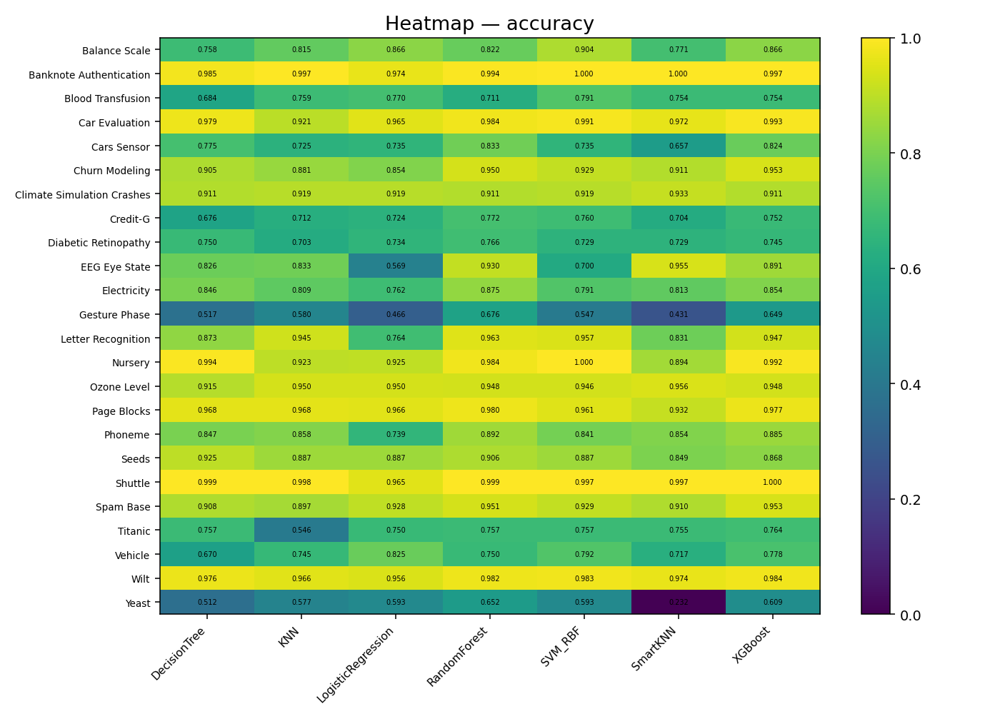
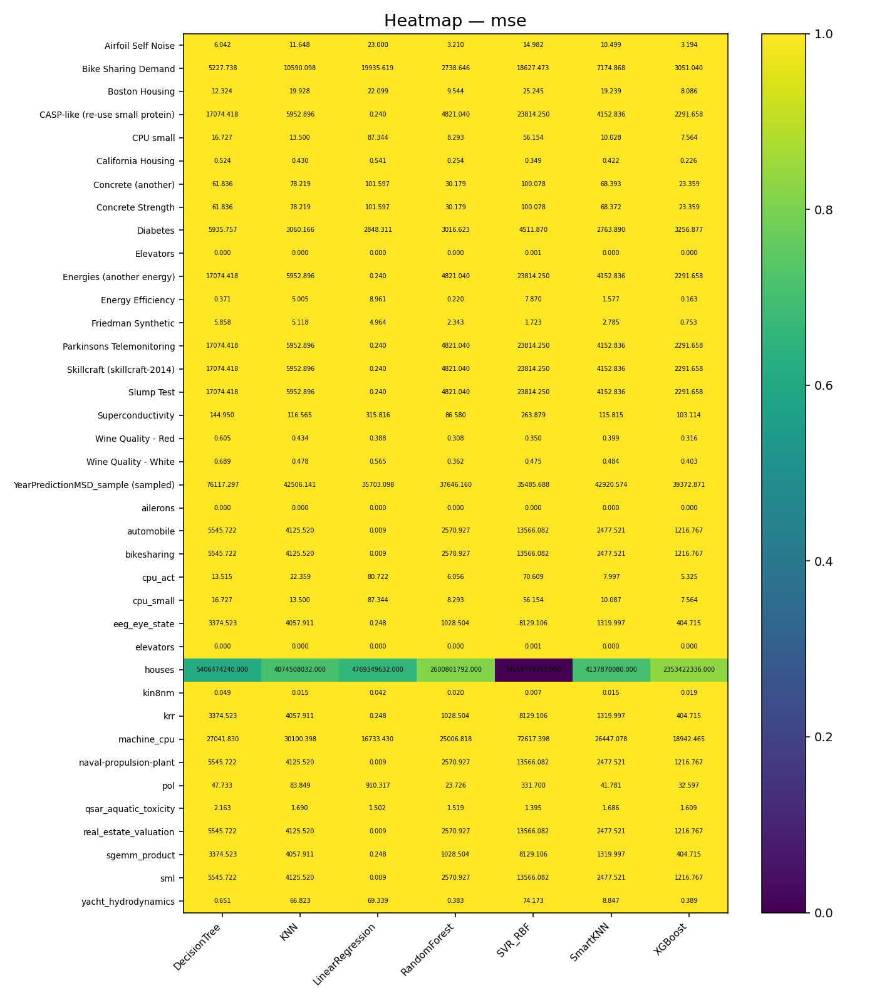

#  SmartKNN

A **smarter, weighted, feature-selective KNN algorithm** that automatically learns feature importance, filters weak features, handles missing values, normalizes data, and delivers significantly better accuracy than classical KNN — all with a **simple sklearn-like API**.

SmartKNN supports both **classification** and **regression**, requires zero manual tuning for preprocessing, and is fully compatible with **NumPy** and **Pandas**.

---

#  Badges

[](https://pypi.org/project/smart-knn/)
[](https://www.python.org/)
[](https://opensource.org/licenses/MIT)
[](#)
[](https://pypi.org/project/smart-knn/)
[](https://doi.org/10.5281/zenodo.17713746)
[](https://huggingface.co/JashuXo/smart-knn)
[](https://medium.com/@thatipamulajashwanthgoud/a-new-smarter-take-on-knn-where-feature-weighting-noise-resilience-and-interpretability-meet-5fc284892669)


---

#  Features

* **Automatic Feature Weighting**

  * Univariate MSE scoring
  * Mutual Information
  * Random Forest importance

* **Automatic Preprocessing**

  * Normalization
  * NaN / Inf cleaning
  * Median imputation
  * Value clipping

* **Automatic Feature Filtering**

  * Removes low-weight & noisy features
  * Keeps only important signals

* **Weighted Euclidean Distance**

* **Scikit-Learn Style API**

  * `fit()`
  * `predict()`
  * `kneighbors()`

* **Supports**

  * NumPy arrays
  * Pandas DataFrames
  * Regression + Classification

---

#  Installation

### Install from PyPI

`bash\	pip install smart-knn`

### Local install

```bash
pip install .
```

---

#  Quick Start

```python
import pandas as pd
from smart_knn import SmartKNN

df = pd.read_csv("data.csv")
X = df.drop("target", axis=1)
y = df["target"]

model = SmartKNN(k=5)
model.fit(X, y)

sample = X.iloc[0]
pred = model.predict(sample)
print("Prediction:", pred)
```

SmartKNN will automatically:

* Normalize inputs
* Learn weights
* Clean NaN/Inf
* Filter weak features

---

#  Predict Multiple Rows

```python
preds = model.predict(X.iloc[:10])
print(preds)
```
---

##  Note on Classification (Temporary — v0.2.x)

SmartKNN was originally designed to auto-detect **classification vs regression** based on the target values.  
In rare cases, integer-valued regression datasets (e.g., energy = 0, 1, 2, 3) could be mistaken for classification and cause errors when evaluated using sklearn metrics.

To guarantee **stability and zero breaking changes for current users**, SmartKNN now:

 Works reliably with both regression and classification inputs  
 Uses **safe numeric prediction output** by default  
 Avoids sklearn "continuous vs multiclass" errors automatically  

If using SmartKNN for **classification**, simply map predictions back to class labels:

```python
preds = model.predict(X_test)
preds = preds.round().astype(int)   
```

A full enhanced classification engine (with probability vote + label-safe decoding) will be released in a future update.


---

#  How SmartKNN Works

1. Learns feature importance (MSE + MI + Random Forest).
2. Removes weak features.
3. Normalizes input.
4. Applies weighted Euclidean distance.
5. Optimized vectorized NumPy inference.

**Results:**

* Higher accuracy
* Faster prediction
* Lower noise sensitivity
* Better generalization

---

#  API Overview

### Initialize

```python
model = SmartKNN(k=5, weight_threshold=0.05)
```

### Fit

```python
model.fit(X, y)
```

### Predict

```python
model.predict(sample)
```

### Neighbors

```python
idx, dists = model.kneighbors(sample)
```

### Inspect Model

```python
model.weights_
model.feature_mask_
model.X_.shape
```

---

#  Hyperparameters

| Parameter          | Description                | Range |
| ------------------ | -------------------------- | ----- |
| `k`                | Number of neighbors        | 3–15  |
| `weight_threshold` | Drop features below weight | 0–0.2 |
| `alpha`            | MSE weight importance      | 0–1   |
| `beta`             | MI importance              | 0–1   |
| `gamma`            | RF importance              | 0–1   |
| `n_jobs`           | Parallel workers           | 1–8   |

---

#  Project Structure

```
smart_knn/
 ├── base_knn.py
 ├── distance.py
 ├── weight_learning.py
 ├── data_processing.py
 ├── utils.py
 ├── evaluation.py
 ├── adaptive_k.py
 ├── prototypes.py
 └── signatures.py

docs/
 ├── design.md
 ├── theory.md
 ├── roadmap.md
 └── usage.md

benchmarks/
 ├── classification_tests/
 ├── regression_tests/
 └── heatmaps/
```

---

#  Benchmark Visuals

```



```
---

#  Roadmap

* Adaptive-K
* Prototype compression
* Neural metric learning
* FAISS / HNSW accelerated search
* GPU support
* Distance signatures
* Incremental learning

---

#  License

SmartKNN is released under the **MIT License**.
See the `LICENSE` file for details.

---

#  Contributing

PRs and feature requests are welcome!
If you like SmartKNN, star  the repository.

---

#  Links
* **PyPI:** https://pypi.org/project/smart-knn
* **GitHub:** https://github.com/thatipamula-jashwanth/smart-knn
* **Zenodo DOI:** https://doi.org/10.5281/zenodo.17713746
* **Hugging Face:** https://huggingface.co/JashuXo/smart-knn
* **Medium Article:** https://medium.com/@thatipamulajashwanthgoud/a-new-smarter-take-on-knn-where-feature-weighting-noise-resilience-and-interpretability-meet-5fc284892669
